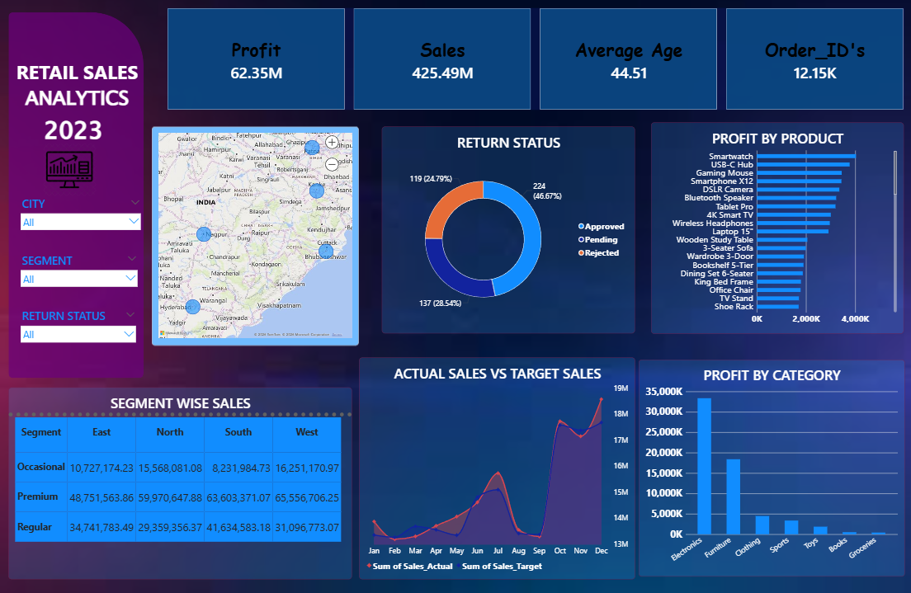

# Retail Sales Analytics Dashboard

## Overview
This project is a Retail Sales Analytics Dashboard created using Power BI to analyze sales, profit, product performance, customer segments, and return status.

The dashboard provides interactive visual insights that help in understanding business performance and sales trends effectively.

---

## Tools Used
- Power BI
- DAX
- Excel / CSV

---

## Features
- Sales & Profit Analysis
- Product-wise Profit Tracking
- Return Status Analysis
- Actual vs Target Sales Comparison
- Interactive Filters and Visuals
- Region-wise Sales Insights

---

## KPIs Included
- Total Sales
- Total Profit
- Achievement
- Average Age
- Order Count

---

## Dashboard Preview

---

## Learning Outcomes
- Data Visualization
- Dashboard Designing
- DAX Calculations
- Business Intelligence Basics

---

## Author
Dinesh Kumar  
Aspiring Data Analyst & Data Science Learner
